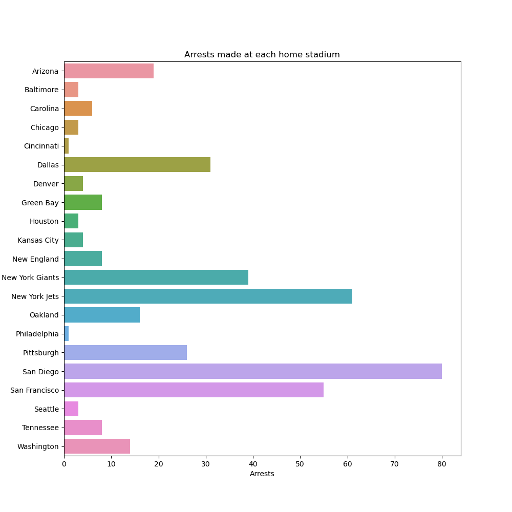
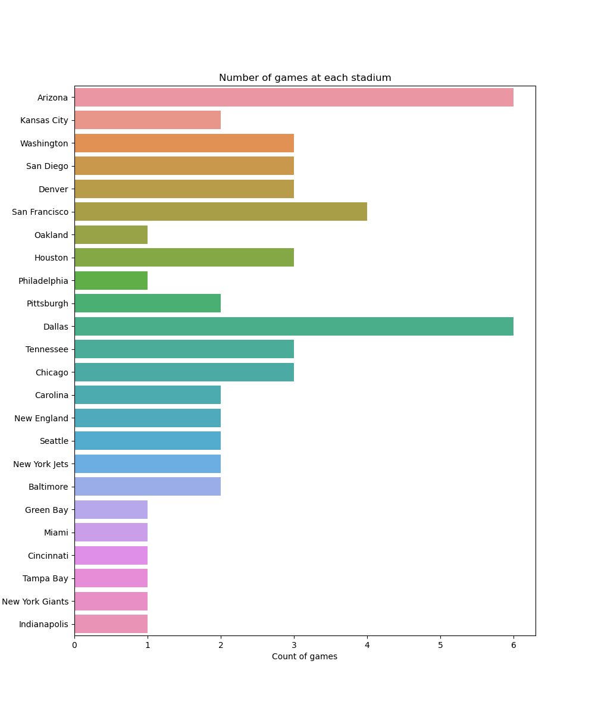
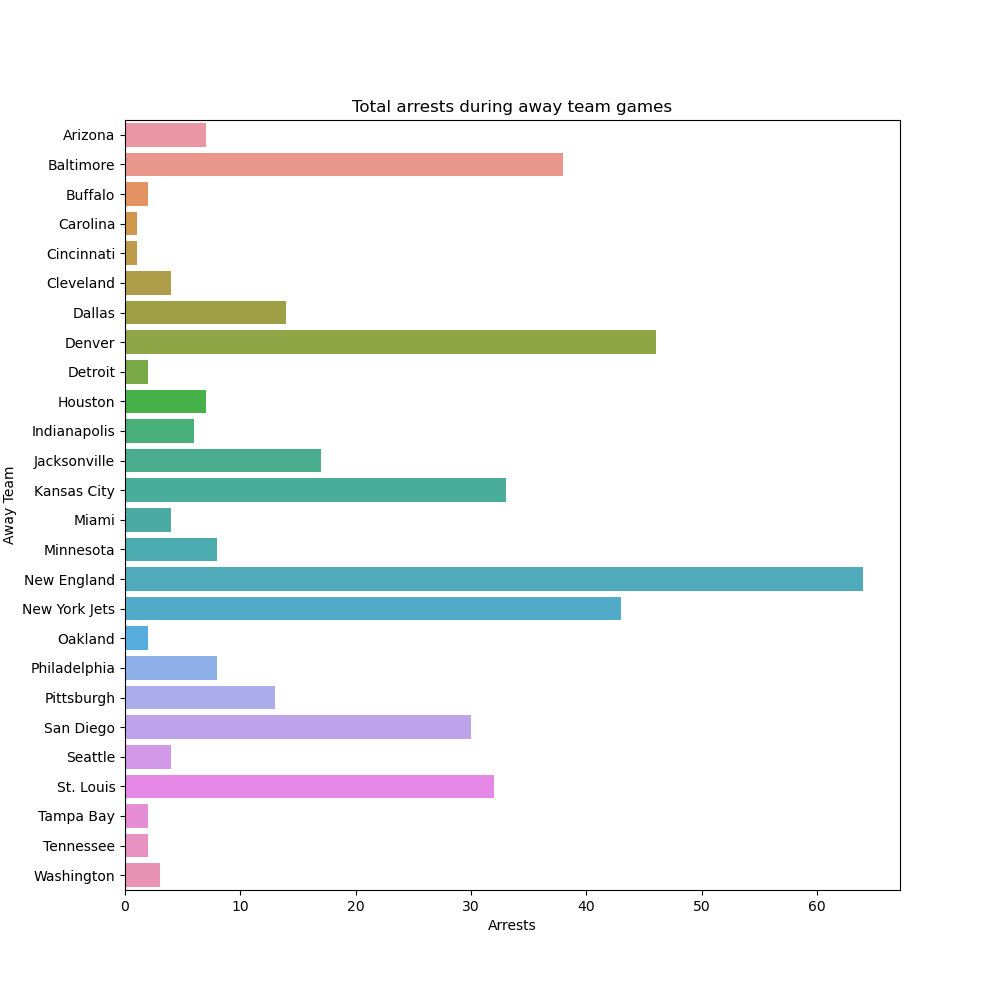
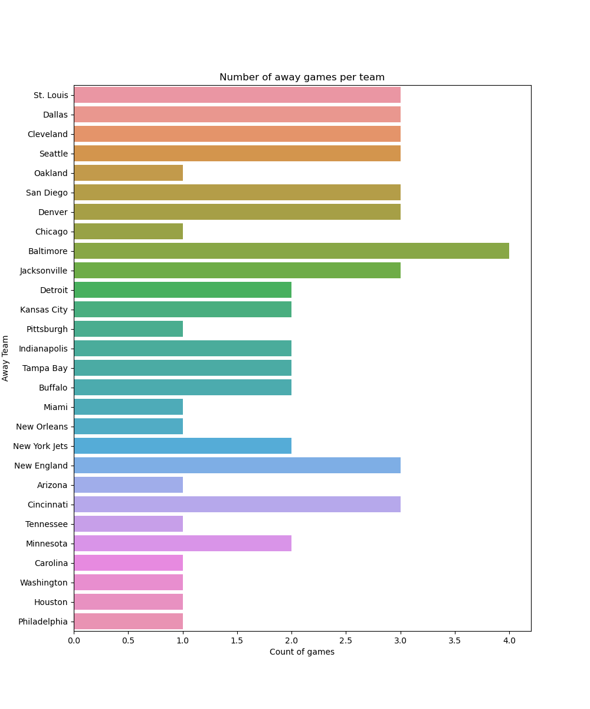
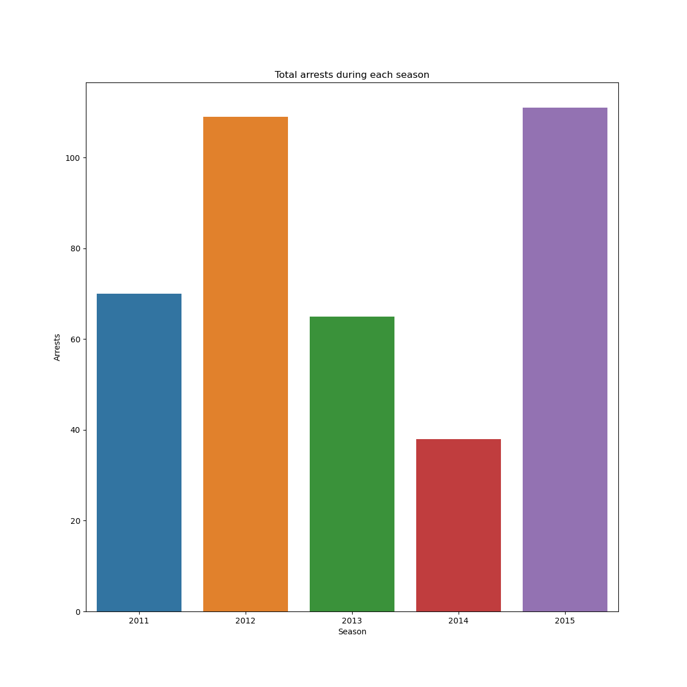
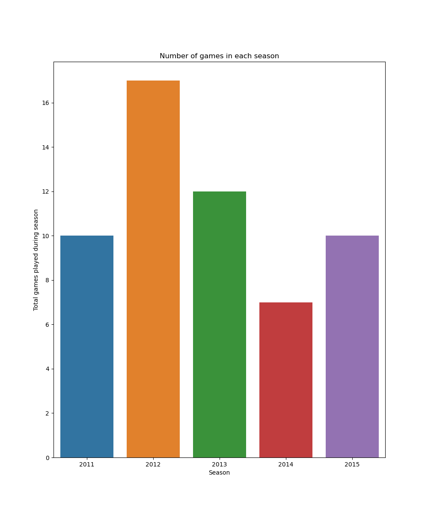

# COSC 301 - Final Project Group 3 - Milestone 5
---
## Introduction

This project focuses on the importance of groupthink in affecting the behavioral outcomes of fans within NFL stadiums. To understand this metric, we utilize NFL arrest data from (2011-2015) collected by authors of the Washington Post. The psychological insight into such a metric may allow data to be utilized in anticipation for rowdy crowds and susceptible environments.

--- 

## Exploratory Data Analysis (EDA)

All exploratory data analysis within this project was constructed, reformatted, and coded within notebooks found [within this repository folder.](https://github.com/ubco-W2022T1-cosc301/project-group03/tree/main/notebooks) The project was constructed based upon metrics asking if  

---
One of the research questions asked which team had the "rowdiest" crowds leading to higher arrests rates. Looking at both home teams and away teams.

Firstly let's take a look at the average arrests made for each team as a home team.

As we can see, San Diego is the team with the rowdiest fans when they are playing at their home stadium, sitting at a total of 80 arrests made through out the 2011-2015 NFL seasons.

Let's give them the benefit of the doubt since they might have more games than other stadiums? So where does San Diego stand at the number of games played at their stadium?

Surprisingly enough, San Diego did not have the highest number of games played at home. But rather they tied for 4th place compared to the other teams.
**San Diego** has half the amount of games as Arizona (the tied leader in the amount of home games), and yet Arizona has almost a 1/4 the arrests that San Diego has seen.

Now let's take a look at the away teams and see if San Diego is also the rowdiest team when they are on the road.

As we can see, it's no longer the San Diego fans being the rowdiest, but instead the **New England** fans!

Again, we're going to do the same analysis and give them the benefit of the doubt since they might have had more games than others as the away team.

Now this gives some interesting insight. Because for away teams, the team with the most arrests is New England (Patriots). They are leading in the number or arrests during their away games, even though they are not leading in the number of away games (count wise). The team with the most away games is Baltimore and yet they have a total of 40 arrests during their away games while New England has closer to 65.

Lastly, let's take a look at whether or not there has been a trend (upwards or downwards) between later seasons and earlier seasons for arrests.

Now this gives us an insight as to which seasons had the highest arrests between all the seasons in our dataset. However, we still need to see how many games were played in each season as that would change the overall result.

After looking at the data, we can see that during the 2012 season, there were more games played, thus creating a higher possibility of conflicts resulting in arrests. Nonetheless, the **2015 season** (that had the secondmost arrests during the season) had 2 more arrests during the season even though there were 7 fewer games during then.

*What do these higher arrests within a season, even though there were fewer games than other seasons, tell us?*

After doing some digging, it turns out that the 2015 season was the 50th anniversary of the [Super Bowl.](https://en.wikipedia.org/wiki/2015_NFL_season)
With the opening game being the **New England** Patriots and the Pittsburgh Steelers.